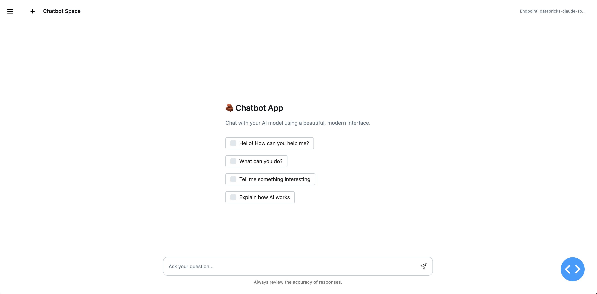
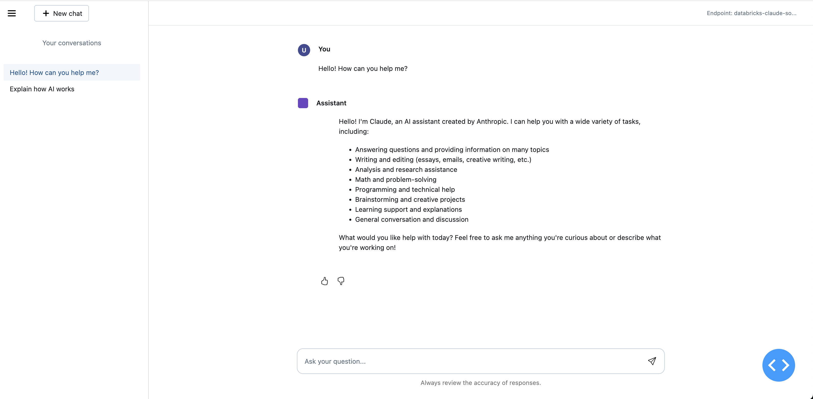
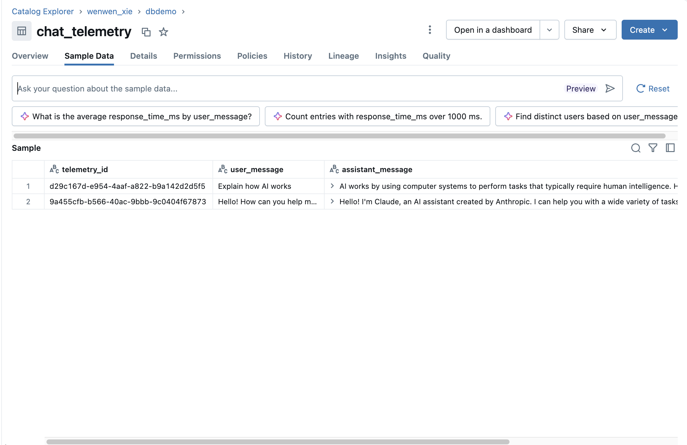

# E2E Chatbot App with Zerobus Telemetry





An end-to-end chatbot application built with **Databricks AgentBricks** and **Zerobus telemetry integration**. This application demonstrates best practices for building AI-powered conversational interfaces with comprehensive telemetry tracking, deployed using **Databricks Asset Bundles (DABS)**.

## 🌟 Features

- 🤖 **AI-Powered Chat Interface**: Beautiful Dash-based UI for conversational AI interactions
- 📊 **Real-time Telemetry**: Comprehensive event tracking using Databricks Zerobus SDK
- 🔄 **Feedback Loop**: Built-in thumbs up/down feedback mechanism for model improvement
- 💾 **Unity Catalog Integration**: Telemetry data stored in Unity Catalog tables
- 🎨 **Modern UI/UX**: Responsive design with Bootstrap components
- 🔐 **OAuth Authentication**: Secure authentication with Databricks OAuth
- 📈 **Model Serving Integration**: Direct integration with Databricks Model Serving endpoints
- 🚀 **Databricks Apps Ready**: Deploy directly to Databricks Apps using Asset Bundles
- 🔄 **CI/CD Integration**: GitHub Actions workflow for automated DABS deployment

## 📋 Prerequisites

- Python 3.9-3.13
- [uv](https://github.com/astral-sh/uv) (recommended) or pip
- Databricks workspace with:
  - Model Serving endpoint
  - Unity Catalog table for telemetry
  - OAuth client credentials
- Zerobus server endpoint

## 🚀 Quick Start

### Clone and Setup

```bash
# Clone the repository
git clone <your-repo-url>
cd e2e-chatbot-app-zerobus
```
## 🔧 Development

### Generate Protobuf Schema

To regenerate the protobuf schema from your Unity Catalog table:

```bash
# Set environment variables
export UC_ENDPOINT="https://your-workspace.cloud.databricks.com"
export TABLE="catalog.schema.table"
export CLIENT_ID="your-client-id"
export CLIENT_SECRET="your-client-secret"
export MESSAGE_NAME="Chat"
export OUTPUT="record.proto"

# Run setup script
bash setup_telemetry.sh
```

Or manually:

```bash
# Generate proto file
python -m zerobus.tools.generate_proto \
  --uc-endpoint "https://your-workspace.cloud.databricks.com" \
  --table "catalog.schema.table" \
  --client-id "your-client-id" \
  --client-secret "your-client-secret" \
  --proto-msg "Chat" \
  --output "record.proto"

# Compile proto file
python -m grpc_tools.protoc \
  --python_out=. \
  --proto_path=. \
  record.proto
```

### Using uv (Recommended)

```bash
# Install dependencies
uv sync

# The Zerobus SDK wheel is automatically installed via pyproject.toml
```

### Using pip

```bash
# Create virtual environment
python -m venv .venv
source .venv/bin/activate  # On Windows: .venv\Scripts\activate

# Install dependencies
pip install -r requirements.txt
pip install databricks_zerobus_ingest_sdk-0.1.0-py3-none-any.whl
```


### Resource Flow

```text
┌─────────────────────┐
│   User Browser      │
└──────────┬──────────┘
           │
           ▼
┌─────────────────────┐      ┌──────────────────────┐
│  Chatbot App        │─────▶│  Model Serving       │
│  (Dash UI)          │      │  Endpoint            │
│                     │◀─────│  (ML Model)          │
└──────────┬──────────┘      └──────────────────────┘
           │
           ▼
┌─────────────────────┐
│  Zerobus Telemetry  │
│  (Unity Catalog)    │
└─────────────────────┘
```


#### Configure Variables

Edit `databricks.yml` with your values:

```yaml
variables:
  serving_endpoint:
    default: "your-existing-endpoint-name"
  zerobus_table:
    default: "your-catalog.your-schema.telemetry"
  zerobus_host:
    default: "https://your-workspace.cloud.databricks.com"
  databricks_client_id:
    default: "your-client-id"
  databricks_client_secret:
    default: "your-client-secret"
  # ... other variables
```

#### Deploy

```bash
# Validate the bundle configuration
databricks bundle validate

# Deploy to development
databricks bundle deploy --target dev

# The bundle will:
# 1. Deploy the chatbot app
# 2. Configure environment variables
# 3. Set up permissions for the model serving endpoint
```

### Manual Deployment

1. Create an app in Databricks Apps UI
2. Upload the application files
3. Configure environment variables in `app.yaml`
4. Deploy and start the app


### Telemetry Data

Query your telemetry data in Unity Catalog:

```sql
-- View recent chat interactions
SELECT * FROM catalog.schema.chat_telemetry
WHERE timestamp > current_timestamp() - INTERVAL 1 DAY
ORDER BY timestamp DESC;

-- Analyze feedback trends
SELECT 
  DATE(timestamp) as date,
  feedback_value,
  COUNT(*) as count
FROM catalog.schema.chat_telemetry
WHERE feedback_value IS NOT NULL
GROUP BY date, feedback_value
ORDER BY date DESC;

-- Track response times
SELECT 
  AVG(response_time_ms) as avg_response_time,
  MAX(response_time_ms) as max_response_time,
  COUNT(*) as total_requests
FROM catalog.schema.chat_telemetry

```
## 🔗 Related Resources

- [Databricks Apps Documentation](https://docs.databricks.com/apps/)
- [Zerobus SDK Documentation](https://docs.databricks.com/zerobus/)
- [Databricks Model Serving](https://docs.databricks.com/machine-learning/model-serving/)
- [Unity Catalog](https://docs.databricks.com/unity-catalog/)

